# Rapport du *Timebomb* d'**IHM**, partie 1: ***Wireframing* et maquette du projet** <!-- omit in toc -->

[par Kalumvuati Duramana, Duran Mike, Ledda Damien & Senol Mustafa]\
**Sommaire**

- [Avant-goût: **à propos du *Timebomb***](#avant-go%c3%bbt-%c3%a0-propos-du-timebomb)
- [Implémentation numérique: ***wireframe* & explications**](#impl%c3%a9mentation-num%c3%a9rique-wireframe--explications)
  - [*Wireframe général*](#wireframe-g%c3%a9n%c3%a9ral)
  - [Les Frameworks](#les-frameworks)
  - [*Détails de la maquette*](#d%c3%a9tails-de-la-maquette)
    - [Menu principal](#menu-principal)
    - [Paramétrage du jeu](#param%c3%a9trage-du-jeu)
    - [Règles du jeu](#r%c3%a8gles-du-jeu)
    - [Sélection du nombre de joueurs & insertion des pseudos](#s%c3%a9lection-du-nombre-de-joueurs--insertion-des-pseudos)
    - [Déroulement du jeu](#d%c3%a9roulement-du-jeu)
    - [Partie terminée](#partie-termin%c3%a9e)

## Avant-goût: **à propos du *Timebomb***

&nbsp; &nbsp; Le ***Timebomb*** original est un jeu de cartes édité par Iello, créé par Yusuke Sato et illustré par Biboun. Se déroulant en plein Londres des années 1890, l'objectif est soit de désamorcer la bombe placée dans la salle de l'horloge de Big Ben, soit de la faire exploser, selon l'équipe qui sera assigné aux joueurs via les *cartes Rôle.* Sherlock devra se surpasser pour la désamorcer au plus vite avant que James (oui, c'est le prénom de Moriarty) ne fasse détruire le monument britannique **lorsque la cloche sonnera une douzième fois...** et compte sur les joueurs de son équipe, car **l'espoir de Londres est entre leurs mains.**\
&nbsp; &nbsp; Pour atteindre son but, Sherlock doit couper 5 fils désamorceurs en 4 manches avec une *pince coupante*. **C'est le seul cas où il pourra sauver Big Ben.** Pourtant, **les *câbles de désamorçage* et les *câbles sécurisés* sont indiscernables**, et une erreur pourrait lui être fatale...

## Implémentation numérique: ***wireframe* & explications**

Cette implémentation se fera principalement en **local**, mais potentiellement sur **un unique support commun à tous les joueurs** (comme dans un party game) pour rajouter un peu de challenge. *Ce support sera considéré comme **mobile**, mais l'utilisation serait plus optimisée pour une tablette ou un 2-en-1 (convertible ou détachable).* Une façon de numériser les jeux de société à plateau, en quelque sorte.\
*Ah, et quel challenge, vous dites?* Celui de **ne pas savoir dans quelle équipe on est, ni quels câbles on a, ni si on détient la bombe (ou une d'elles, si l'addon *More\ bombs!* sera en place)**.

_Nota bene_: Cependant, même si le fait d'implémenter ce challenge est envisagé, il sera toujours possible de montrer secrètement les cartes, notamment quand le mode *Solo* sera implémenté en conséquence de l'ajout potentiel d'une IA ou si l'implémentation à plusieurs supports sera mis en place.

### *Wireframe général*

### Les Frameworks

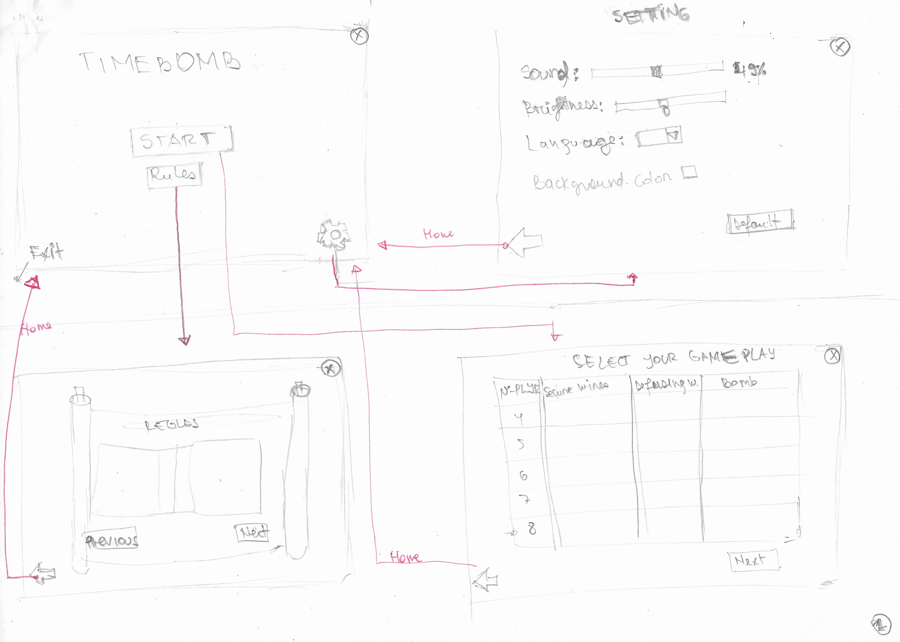

- La première case à gauche la liaison entre le bouton start,rules,settings (présenté sous forme de roue), et à ne pas oublier la sortie du jeu 'Exit'
- La deuxieme case à droite :Settings, qui peut etre sortie par la flèche gauche, reviens sur le titre de jeu.
- Rules: nous ammène à l'écran de règles. Aussi équipé d'un bouton retour. Next permet de tourner la page des règles. Previous permet de retourner à la page précédente

Après un appui sur *Start*, *Select\ your\ Gamemode* sera affiché.

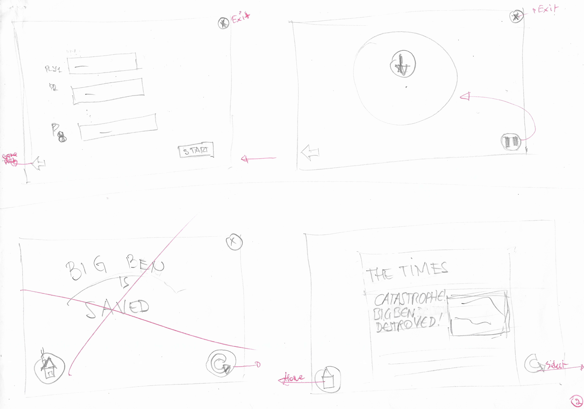

- Après la selection du gameplay (haut à gauche) les noms des joueurs seront indiqués. Le bouton 'start' permet d'accéder au jeu. (Voir prochain framework. (haut à droite)).
- (bas à droite) est l'affichage du gagnant qui dépend si l'équipe de Holmes ou celle de Moriarty gagne. *Dans ce framework, c'est le cas de James. Même si on avait tenté celui de Sherlock.*

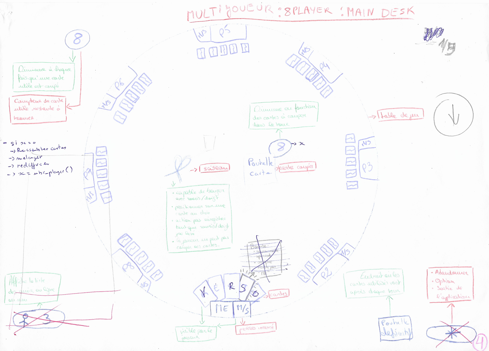
*Premiere approche du désign d'une partie du jeu avec toutes ses fonctionnalités détaillées. (L'exemple d'une partie à huit joueur nous semblait le plus cohérent en fonction de la limite de notre interface.)*

_Note_: Dans la suite, les images utilisées seront des rendus plus précis (au cas par cas) du wireframe qu'on a prévu. Et, bien sûr, **les images utilisées plus bas appartiennent à leur créateur respectif et risqueraient de changer dans l'implémentation finale**.

### *Détails de la maquette*

#### Menu principal

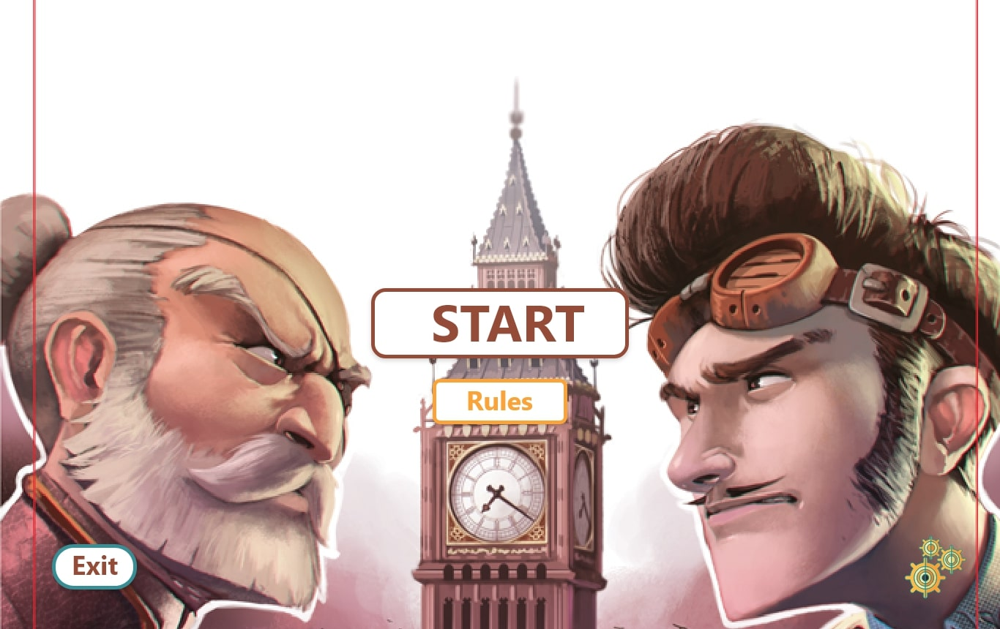
*le bouton start et rules auront leurs fonctionnement, les roues signifient accès au settings.*

Le **menu** sera le premier écran du jeu. Le fait de centrer *Start* et *Rules* accentue leur accessibilité car l'oeil est principalement concentré au centre d'un menu lors du lancement d'une application, privilégiant le contenu avant les bords. Les paramètres seront placés **en bas à droite** pour mieux l'aérer, notamment si la densité de pixels par pouce est (très) faible. En haut à droite se situera la **sortie**... car les personnes utilisant un OS (notamment sur un PC) sont plus habitués à fermer leur fenêtre en positionnant leur curseur/doigt en haut à droite, *sauf s'il détient un Mac ou une version customisée (ou de base, ça dépend de quelle distro) d'un OS sous Linux.* **Elle y sera accessible à tout moment, même en plein jeu**.

#### Paramétrage du jeu

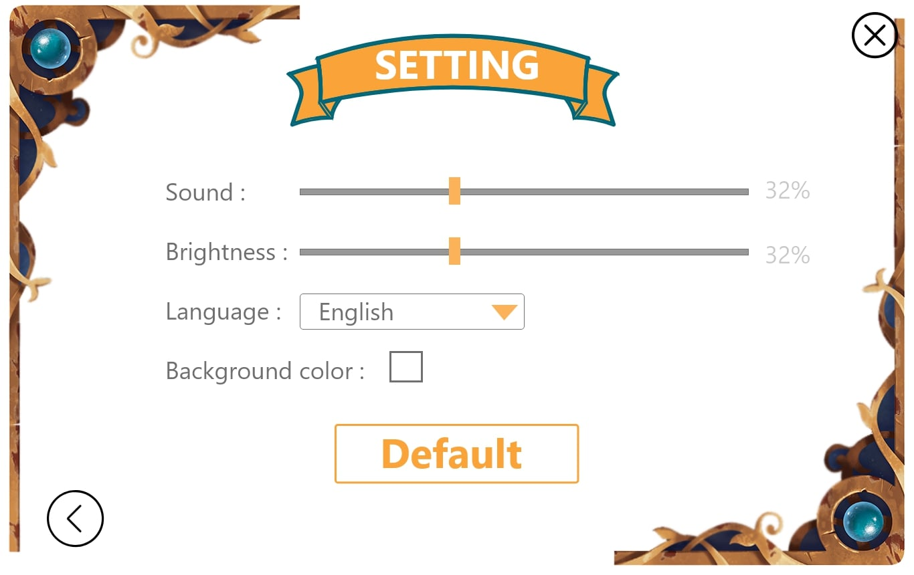
*Les paramètres montrés ici ne sont que pour but de montrer comment ça sera affiché. Bien sûr, la police pourra être en sérif et les paramètres implémentés sont différents.*

Les **paramètres** auront pour but de modifier l'expérience du jeu. Il sera possible d'en modifier le **volume global** par un *slider* à *picker*, la *langue* par une liste de locales, ... **Les changements s'y feront probablement automatiquement.** Si jamais l'utilisateur voudra retrouver les valeurs par défaut de l'implémentation, un bouton *Default* sera placé **en bas à droite**, soit à la place de l'icône des paramètres dans le menu. Là encore, l'icône de sortie du jeu sera accessible toujours à la même place, mais s'ajoutera celle de *retour au menu* en haut à **gauche**, à raison d'habitude à avoir un bouton *Précédent* en haut à gauche.

_Nota bene_:

- Si les paramètres n'auront pas pu être automatiquement changés, un bouton *Apply* sera placé en bas au **centre**.
- Les paramètres inclus dans l'implémentation seront **progressifs**. Tous les paramètres ne seront pas implémentés, mais juste une partie d'entre eux.
- **La locale pourra changer le mode de lecture du jeu** si jamais elle est ajoutée. Il devra donc s'adapter à celle choisie.
- Une fois implémentée, **l'IA sera paramétrable selon sa difficulté** par une liste (ou un groupe de *radio buttons*).

#### Règles du jeu

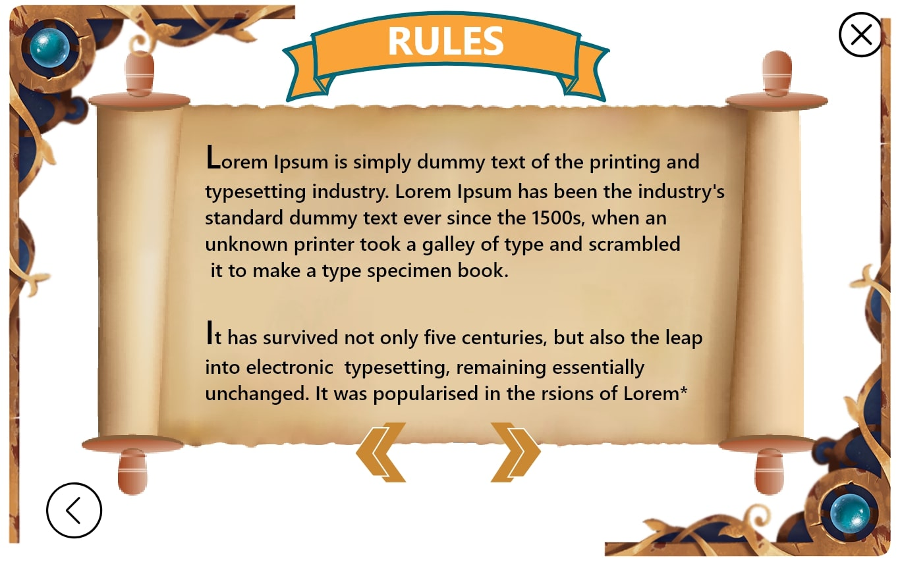
*Bien sûr, les règles remplaceront le Lorem Ipsum dans l'implémentation finale!*

Les **règles du jeu** seront implémentées de façon accessible et dans le thème de celui-ci. Pour naviguer dans les règles, il utilisera les boutons *Previous* et *Next*. Là encore, les icônes de sortie et de retour au menu y seront encore présent à leur place si jamais ils veulent respectivement quitter le jeu ou retourner au menu.

#### Sélection du nombre de joueurs & insertion des pseudos

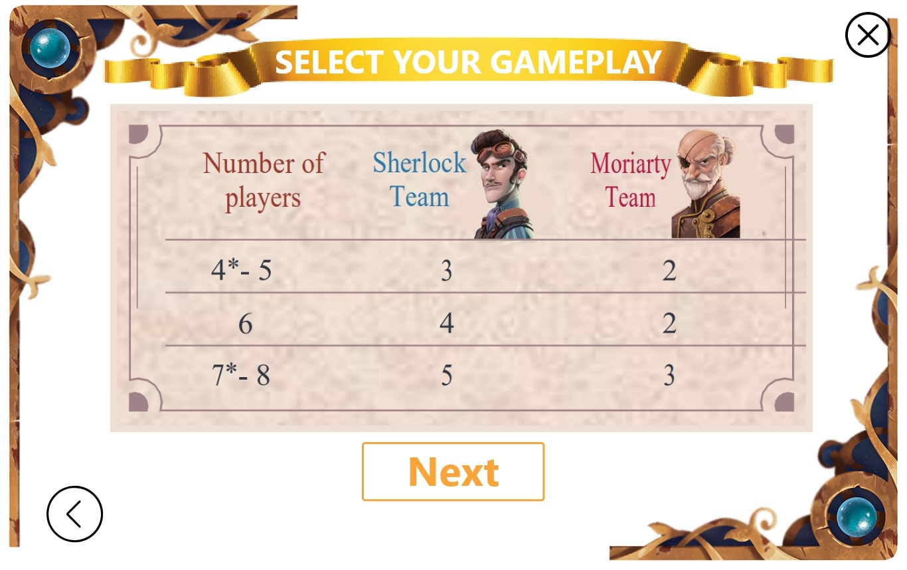
*Qui allez-vous être? Ça dépendra de combien vous êtes!*

Pour la **sélection du nombre de joueurs**, un "tableau" comprendra dans chaque ligne le nombre de joueurs et le nombre de cartes Rôle nécessaire par équipe. Chaque ligne sera cliquable,lançant la possibilité d'insérer des **pseudos** qui identifieront chaque joueur après appui sur le bouton *Next* **afin d'eviter qu'une confusion n'arrive: celle portant la question "À qui le tour?"**.

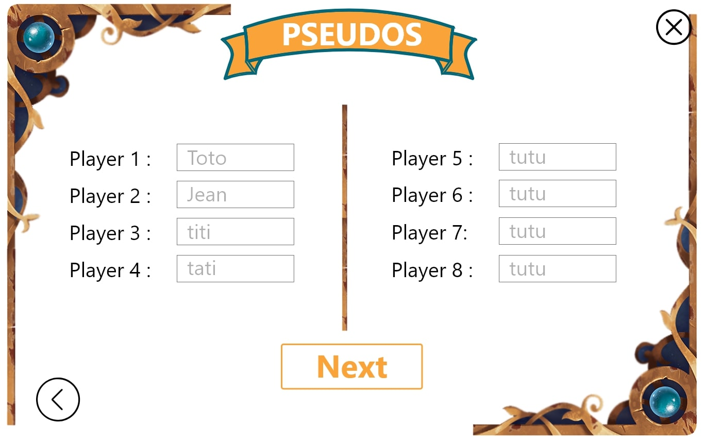
*L'écran des pseudonymes. Mémorisez bien le pseudo que vous avez inséré, et évitez de mettre plusieurs fois le même!*

_Nota bene_: Si l'addon *More\ bombs!* sera implémenté, le nombre de bombes sera sélectionnable, mais restera inférieur ou égal à *5*(nombre\ de\  joueurs-1)*. Il sera dans ce cas possible de créer un mode *Sudden\ death* où, pour 4 joueurs par exemple, il y aura 5 cartes de désamorçage et **15** bombes.

#### Déroulement du jeu

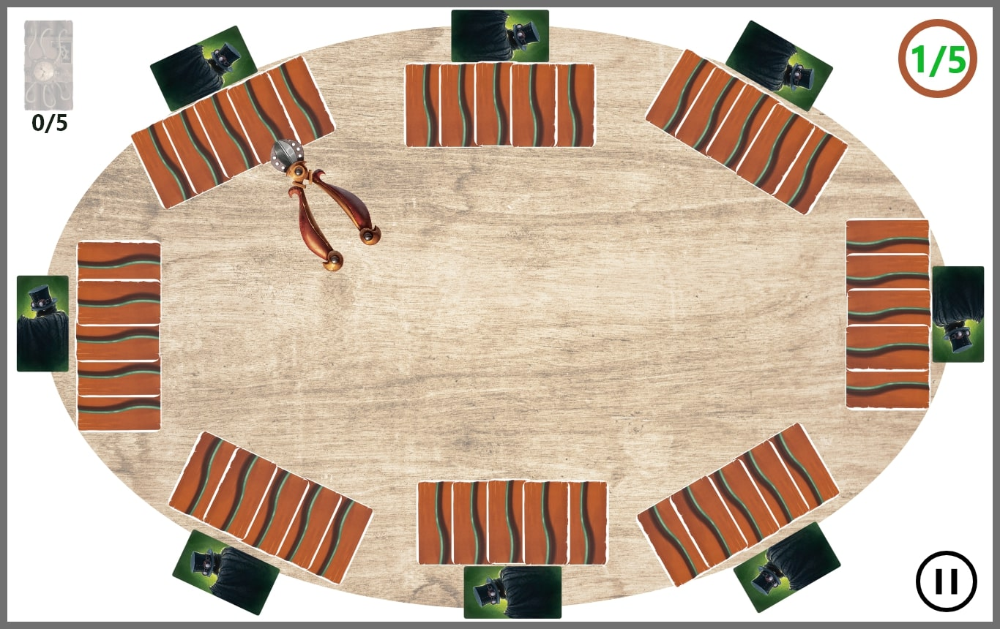
*La structure basique du jeu (dans le cas de 8 joueurs).*

Le jeu se déroulera de la façon suivante:

- Placement des joueurs sur la "table ronde" et distribution des rôles mélangés **face cachée**
  - *Si le mode *Solo* est implémenté, montrer le rôle du joueur*
- Distribution des cartes câble mélangées **face cachée**
  - **Note**: chaque joueur devra avoir **5 câbles** au début du jeu. Pas plus, mais le nombre décrémentera au fur et à mesure des manches.
  - *Si le mode *Solo* est implémenté, montrer les câbles possédés par le joueur*
- Attribution de la pince à un des joueurs
  - *Il pourra choisir une des cartes câble des joueurs **adverses** en cliquant sur l'une d'elles*
- Si la bombe n'a pas été choisie par le coupeur, **don de la pince au joueur dont le câble a été coupé**
- Si le nombre de câbles coupés est égal au nombre de joueurs, **les câbles non coupés seront mélangés et redistribués équitablement et les câbles coupés seront sauvegardés dans des compteurs appropriés**.

&rArr; La boucle "Distribution des câbles -> coupages -> mélange" durera **3 manches**.

Lorsque la partie se termine suivant l'une des 3 conditions, **toutes les cartes Rôle des joueurs seront révélées** afin de révéler qui était qui, donc de lever le mystère de qui a coupé le dernier câble de désamorçage ou la bombe.

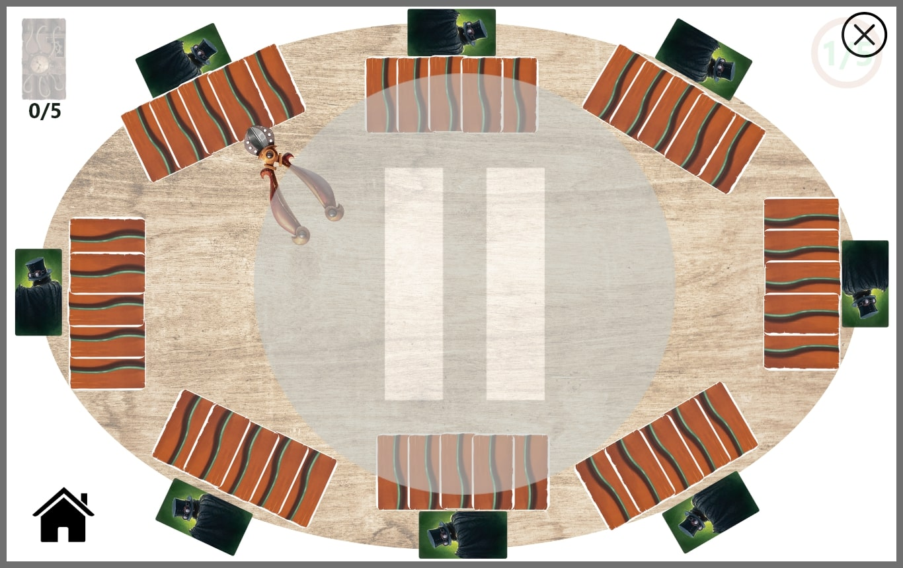
*L'écran de pause de la partie actuelle initiée par le joeur actuel.*

_Nota bene_: Il sera peut-être aussi possible de révéler les câbles restants, pour montrer qui avait la bombe ou les derniers câbles de désamorçage. À tout moment il sera possible pour le joueur actuel de mettre la partie en pause et la reprendre à tout moment.

#### Partie terminée

La partie se terminera lorsqu'une des 3 conditions, dont une seule sera associée à l'équipe de Sherlock (celle où les 5 câbles de désamorçage sont découpés avant la fin de la 4ème manche), a été remplie. Pour rester dans la thématique de Londres des années 1890, elle sera sous forme de *une d'un journal britannique*.

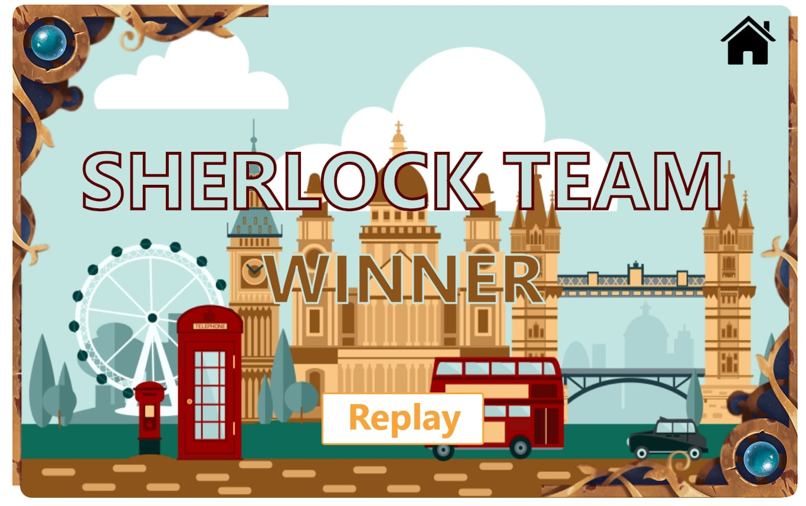
*L'écran de fin de partie au moment où L'équipe de Sherlock Holmes a gagné et a ainsi sauvé Big Ben.*

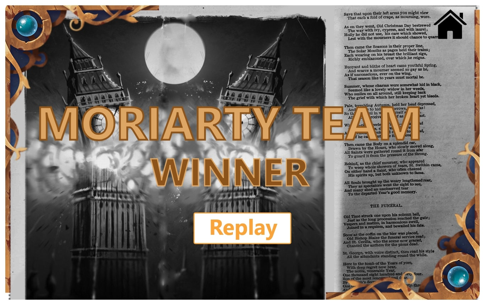
*L'écran de fin de partie au moment où L'équipe de James Moriarty a gagné et a ainsi détruit Big Ben.*
