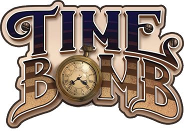

\
**Un projet d'IHM de l'implémentation numérique du jeu**
=

*Timebomb*? **Kezako?**
-

Le *Timebomb*, c'est un jeu de cartes où le but est soit de sauver Big Ben, soit de le détruire. Le jeu se déroule en 4 rounds, ou moins si la bombe est coupée.

Et maintenant, **un petit peu d'histoire.**
-

> Londres, 1890. Fièrement logé au sommet de la tour Élizabeth, Big Ben résonne les coups de cloches dans la cité victorienne. Les passants profitent du temps ensoleillé lors de leur trajet (notamment à proximité de la tour). Mais derrière ces bruits de communications et de rires se figent un Sherlock et des compagnons silencieux.\
> Entre deux coups, une sonnerie retente soudainement d'une cabine téléphonique du coin de la rue. Le coeur lourd, Sherlock s'empresse de le décrocher. Tendu lorsqu'il a entendu le message, il court vers la tour, en direction de l'horloge. Ce message était la crainte d'une potentielle explosion de la cloche par une bombe posée par James Moriarty et ses sbires. Il n'y a pas de temps à perdre.

OK, mais **comment on gagne?**
-

C'est simple: si vous êtes du côté de Sherlock, **découpez les 5 défuseurs avant la fin des 4 rounds**. Sinon, si vous êtes chez Moriarty, il vous faudra **les en empêcher** ou **déclencher la bombe** comme un bon gros bourrin.

Ah! **Combien peut-on être?**
-

Vous pouvez être **entre 4 et 8**, ou potentiellement **seul** (si jamais on a pu dev l'IA et implémenter le mode Solo). Par contre, vous ne déciderez pas de votre rôle, vu qu'il est distribué **automatiquement**!

Et, uhh... **comment on le compile?**
-

Vous pouvez lancer **QtCreator** pour l'ouvrir, le compiler et le lancer. Mais si vous ête du genre "Ah, j'ai la flemme d'installer un logiciel", on a aussi instauré une version de compilation/lancement via terminal. Il suffit de lancer dans cet ordre les fichiers sh:
## TBCompile &rArr; timebomb (&rArr; TBClean)

**MAIS!** vous aurez besoin de ces paquets:

- **Qt5** (de préférence, Qt4 peut aussi fonctionner)
- **QtMultimedia5-dev** (pour le côté multimédia)
- **QMake** et **G++** (ou **GCC**, pour la compilation)
- **CMake** (pour le Makefile)

Ah, et vous aurez aussi besoin de **300 Mo de stockage**. Oui, c'est lourd pour ce que c'est.

## Bonne chance, et le destin de Big Ben est entre vos mains (ou votre curseur, puisqu'il s'agit simplement de cliquer sur des boutons)!
